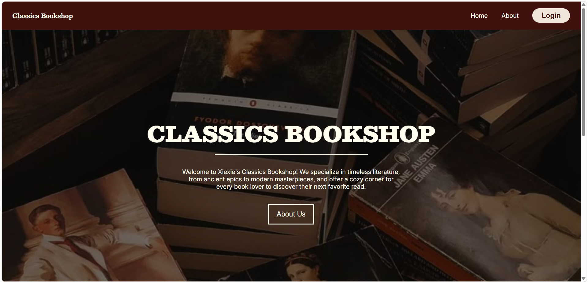

# CLASSICS BOOKSHOP



Classics Bookshop is a front-end web application built with React, TypeScript, and Vite, designed to serve as an online store for classic literature. It has the following features:

- It has a landing page that contains a hero and products sections, and an about page that details the story of the bookshop.
- Each book in the products section is clickable, and once clicked, you will be navigated to the product's details page.
- An admin login page where once authenticated, the admin can browse through the available books in the booksshop.

## Tech / Tools

- React Js + TypeScript
- Vite
- CSS
- Node JS

## Setup

```
git clone git@github.com:jagonosalexandra/classics-bookshop.git
cd classics-bookshop
npm install
```

## Usage

```bash
npm run dev
```
